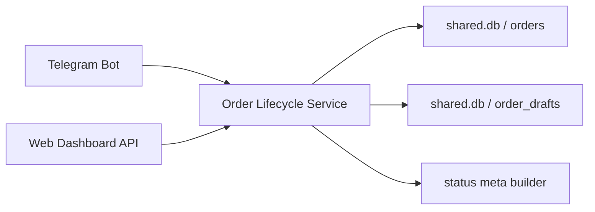

# ТЗ: пакет «Управление заявкой»

## 1. Executive Summary & Goals

Цель пакета — внедрить единый блок «Улучшение жизненного цикла заявки» поверх уже существующего сценария создания заявки, экрана подтверждения, списка заявок, карточки сделки и таймлайна. В пакет входят: быстрые фильтры по статусам, ETA/причина текущего статуса, повтор прошлой сделки, сохранение заявки в черновик и продолжение из черновика. Порядок внедрения внутри пакета: фильтры → статусные подсказки → повтор сделки → черновик. 

Ключевые бизнес-цели:

* сократить путь пользователя к повторной заявке;
* сделать текущий статус заявки понятным без обращения в поддержку;
* снизить потери незавершённых заявок за счёт черновика;
* реализовать изменения как расширение текущего флоу, а не как новую подсистему. 

---

## 2. Current Situation Analysis

### 2.1. Что уже есть в backend и bot

В доменной модели уже существует `OrderDB` с полями `order_id`, `user_id`, `exchange_type`, `from_currency`, `to_currency`, `amount`, `network`, `address`, `rate`, `fee_percent`, `fee_amount`, `receive_amount`, `status`, `created_at`, `updated_at`. Поддерживаемые статусы в backend: `new`, `processing`, `waiting_payment`, `completed`, `cancelled`. В БД уже есть листинг заявок пользователя с опциональным фильтром по одному статусу (`list_orders_for_user(..., status=Optional[OrderStatus])`) и обновление статуса по `order_id`.

В Telegram-боте уже реализованы:

* экран подтверждения заявки с кнопками `Подтвердить / Изменить / Отмена`;
* создание заявки по `exchange:confirm` с сохранением в `orders`;
* переход в «Мои заявки» после создания;
* список заявок и карточка отдельной заявки.
  При этом карточка заявки сейчас показывает только базовый статус, сумму, курс, комиссию, адрес и даты создания/обновления, без расшифровки причины статуса, ETA и следующего шага.

### 2.2. Что уже есть во frontend dashboard

Во frontend уже есть страницы:

* `/dashboard/deals` — список сделок;
* `/dashboard/deals/:id` — карточка сделки;
* `/dashboard/new-deal` — мастер создания новой сделки. 

Список сделок уже содержит локальные фильтры, но они работают только по `mockDeals`; карточка сделки уже использует `StatusBadge` и `Timeline`; страница новой сделки уже реализована как 3-шаговый мастер с экраном успешного завершения. Это значит, что UX-слоты под пакет уже подготовлены, но пока не подключены к реальным данным.

### 2.3. Основные ограничения текущей архитектуры

Во frontend статусная модель отличается от backend: в TS используются `pending | verified | processing | completed | cancelled`, тогда как в backend — `new | processing | waiting_payment | completed | cancelled`. Без унификации статусов фильтры, бейджи и статусные подсказки будут расходиться между каналами.

Есть и более глубокое ограничение: backend-заявки привязаны к Telegram-пользователю через `OrderDB.user_id: int` и `ExchangeUserDB.telegram_user_id`, а web-auth использует отдельную модель `WebUserDB` со строковым `id` и отдельные auth-сессии. Это означает, что для полноценного «живого» dashboard нужен явный механизм связывания web-user ↔ exchange-user; иначе web-страницы сделок останутся только демонстрационным слоем.

---

## 3. Proposed Solution / Refactoring Strategy

### 3.1. High-Level Design / Architectural Overview

Рекомендуемый подход: реализовать пакет не как набор разрозненных UI-правок, а как единый слой `order lifecycle`, который будет переиспользоваться ботом и web-слоем.



Принципы решения:

1. **Не добавлять `draft` в `OrderStatus`.**
   Черновик — это не статус боевой заявки, а отдельная сущность промежуточного состояния формы. Иначе сломаются существующие счётчики активных заявок, фильтрация и логика уже созданных заказов.

2. **Статусные комментарии и ETA собирать централизованно.**
   Не дублировать логику в bot и frontend. Один service-builder должен возвращать `status_meta` для списка и карточки.

3. **Повтор сделки строить на переиспользовании формы.**
   Повтор не создаёт новую заявку автоматически. Он формирует prefill payload и открывает стандартный сценарий создания с уже заполненными данными.

4. **Черновик — отдельная сущность и отдельный CRUD.**
   Она хранит частично заполненные поля формы, текущий шаг, источник создания (`manual` / `repeat`) и время обновления.

### 3.2. Scope

**В scope пакета:**

* быстрые фильтры по статусам;
* статусный комментарий, ETA и следующий шаг;
* повтор сделки из истории;
* сохранение черновика и продолжение из него;
* API/handlers/DTO, необходимые для этих сценариев;
* интеграция в Telegram bot;
* контрактная интеграция в web dashboard.

**Вне scope пакета:**

* мультичерновики;
* авто-сохранение на каждом поле;
* ручное редактирование ETA менеджером;
* генерация новых документов;
* полное решение cross-channel identity linking, если оно ещё не принято на уровне продукта.

### 3.3. Key Components / Modules

#### A. `shared/types/enums.py`

Изменения:

* сохранить `OrderStatus` каноническим;
* добавить enum для черновика, например:

  * `DraftSource = manual | repeat`
  * `DraftStep = amount | address | confirm`

#### B. `shared/models.py`

Добавить новую модель `OrderDraftDB`.

Предлагаемый состав полей:

* `draft_id: str`
* `owner_channel: Literal["telegram", "web"]`
* `owner_id: str`
* `source: DraftSource`
* `source_order_id: Optional[str]`
* `exchange_type: Optional[ExchangeType]`
* `from_currency: Optional[str]`
* `to_currency: Optional[str]`
* `amount: Optional[Decimal]`
* `network: Optional[str]`
* `address: Optional[str]`
* `use_whitelist: Optional[bool]`
* `current_step: DraftStep`
* `schema_version: int`
* `created_at`
* `updated_at`
* `expires_at: Optional[datetime]`

Отдельно в response DTO ввести `StatusMeta`, но не обязательно хранить его в Mongo как постоянное поле.

#### C. `shared/db.py`

Добавить:

* `create_or_replace_order_draft`
* `get_current_order_draft`
* `delete_order_draft`
* `list_order_drafts` (опционально, если понадобится позже)
* расширение `list_orders_for_user` до multi-filter или групповых фильтров;
* индексы для `order_drafts`:

  * `(owner_channel, owner_id, updated_at desc)`
  * уникальный активный черновик на `(owner_channel, owner_id)` для MVP.

#### D. `order_lifecycle_service`

Новый сервисный слой, например `shared/services/order_lifecycle.py` или аналог в web/services, который будет:

* нормализовать статус;
* строить `status_meta`;
* сериализовать заявку в payload для повтора;
* сериализовать/десериализовать черновик;
* выполнять submit черновика в боевую заявку;
* валидировать актуальность draft schema и полей.

#### E. `bot/crypto_exchange_bot.py`

Изменения:

* фильтры в списке заявок;
* вывод `причина статуса / ETA / следующий шаг` в деталях;
* кнопка `Повторить`;
* кнопка `Сохранить как черновик` на подтверждении;
* сценарий `Продолжить черновик` при входе в обмен.

#### F. `web/routers/orders.py`

Новый router для dashboard-order API по образцу существующих web-router/service-pattern.

#### G. `front/src/lib/ordersApi.ts`

Новый клиентский API-слой для dashboard:

* список заявок;
* детали заявки;
* repeat;
* get/save/delete draft.

#### H. `front/src/types/index.ts`

Обновить типы:

* убрать расхождение статусов;
* ввести `DealStatusMeta`;
* расширить `Deal` полями `statusMeta`, `canRepeat`, `draftSource?`.

---

## 3.4. Detailed Action Plan / Phases

### Phase 0: Нормализация контракта статусов и границ пакета

**Priority:** Critical

#### Task 0.1. Зафиксировать канонический набор статусов

**Rationale/Goal:** Сейчас frontend и backend используют разные статусы. Без унификации фильтры и бейджи будут расходиться.
**Estimated Effort:** S
**Deliverable/Criteria for Completion:**

* документирован единый canonical status contract;
* frontend `DealStatus` приведён к backend-модели или вводится явный mapping-layer;
* `verified` переносится из top-level статуса в шаг таймлайна/derived UI state.

#### Task 0.2. Зафиксировать owner strategy для draft и dashboard

**Rationale/Goal:** Черновики и web-повторы не должны зависеть от Telegram-only `user_id`.
**Estimated Effort:** S
**Deliverable/Criteria for Completion:**

* принято решение: для draft используется `owner_channel + owner_id`;
* описано, как web-user будет получать доступ к «своим» данным в MVP.

---

### Phase 1: Быстрые фильтры в списке сделок

**Priority:** High

#### Task 1.1. Расширить backend-фильтрацию списка заявок

**Rationale/Goal:** В БД уже есть фильтрация по одному статусу; для пакета нужны быстрые продуктовые фильтры.
**Estimated Effort:** S
**Deliverable/Criteria for Completion:**

* API/DB поддерживают фильтры `all`, `active`, `new`, `waiting_payment`, `processing`, `completed`, `cancelled`;
* пагинация не ломается;
* count и list используют одинаковую filter-spec.

#### Task 1.2. Внедрить фильтры в Telegram-бот

**Rationale/Goal:** Бот уже имеет список заявок; это самый дешёвый канал для получения ценности.
**Estimated Effort:** S
**Deliverable/Criteria for Completion:**

* в списке заявок есть inline-фильтры;
* фильтр сохраняется при переходе в карточку и назад;
* пустое состояние отображается корректно.

#### Task 1.3. Внедрить фильтры в web dashboard

**Rationale/Goal:** На странице `/dashboard/deals` фильтры уже есть, но сейчас они работают только по мокам.
**Estimated Effort:** M
**Deliverable/Criteria for Completion:**

* фильтры работают от API;
* выбранный фильтр хранится в query string;
* summary «показано X из Y» считается по live data.

---

### Phase 2: ETA / причина текущего статуса

**Priority:** High

#### Task 2.1. Ввести `status_meta` builder

**Rationale/Goal:** Карточка заявки и список должны показывать не только название статуса, но и объяснение.
**Estimated Effort:** S
**Deliverable/Criteria for Completion:**
Для каждого статуса сервис возвращает:

* `title`
* `reason`
* `eta_text`
* `next_step`
* `is_terminal`

#### Task 2.2. Описать базовую матрицу подсказок

**Rationale/Goal:** Нужен единый UX-текст для всех каналов.
**Estimated Effort:** S
**Deliverable/Criteria for Completion:**
Согласована таблица:

* `new` → «Заявка получена, ожидает первичной обработки», ETA: «обычно до 15 минут», next step: «менеджер проверит параметры».
* `waiting_payment` → «Ожидаем поступление/подтверждение оплаты», ETA: «зависит от платёжного канала/сети».
* `processing` → «Операция выполняется», ETA: «обычно 5–15 минут».
* `completed` → «Сделка завершена».
* `cancelled` → «Сделка отменена», next step: «можно повторить заявку».

#### Task 2.3. Показать `status_meta` в bot detail и web detail

**Rationale/Goal:** Это видимая ценность без тяжёлых сущностей.
**Estimated Effort:** S
**Deliverable/Criteria for Completion:**

* в карточке заявки видны причина, ETA и следующий шаг;
* в списке заявок отображается короткая подсказка или tooltip/secondary line;
* для terminal statuses ETA не показывается.

---

### Phase 3: Повтор прошлой сделки

**Priority:** Medium

#### Task 3.1. Реализовать `repeat seed` из существующей заявки

**Rationale/Goal:** Повтор должен переиспользовать текущую форму, а не создавать отдельный сценарий.
**Estimated Effort:** M
**Deliverable/Criteria for Completion:**

* сервис умеет превратить заявку в payload формы;
* копируются только допустимые поля: направление, валюты, сеть, адрес, сумма;
* не копируются rate, fee, timestamps, status, order_id.

#### Task 3.2. Добавить действие `Повторить` в карточку и список

**Rationale/Goal:** Повтор должен быть доступен из точки, где пользователь уже находится.
**Estimated Effort:** S
**Deliverable/Criteria for Completion:**

* в bot detail есть кнопка `Повторить`;
* в web detail есть CTA `Повторить сделку`;
* в списке можно открыть repeat хотя бы из detail-view.

#### Task 3.3. Открывать форму с prefill и актуальным расчётом

**Rationale/Goal:** Повтор сделки не должен использовать старый курс.
**Estimated Effort:** S
**Deliverable/Criteria for Completion:**

* форма открывается с заполненными полями;
* расчёт пересчитывается по текущим правилам;
* пользователю явно показано, что это новая заявка на основе старой.

**Правило для MVP:** повтор доступен только для `completed` и `cancelled`.

---

### Phase 4: Черновик заявки

**Priority:** Medium / High

#### Task 4.1. Ввести отдельную сущность `order_drafts`

**Rationale/Goal:** Черновик — это частично заполненная форма, которая не укладывается в обязательные поля `OrderDB`.
**Estimated Effort:** M
**Deliverable/Criteria for Completion:**

* создана коллекция `order_drafts`;
* хранится один активный draft на пользователя/канал;
* есть `schema_version` для миграции формы в будущем.

#### Task 4.2. Сохранение черновика на шаге подтверждения

**Rationale/Goal:** Это прямо соответствует целевому сценарию из задачи.
**Estimated Effort:** M
**Deliverable/Criteria for Completion:**

* на confirm step есть кнопка `Сохранить как черновик`;
* сохраняются все введённые поля и `current_step=confirm`;
* повторное сохранение обновляет текущий draft.

#### Task 4.3. Resume draft при старте нового сценария

**Rationale/Goal:** Пользователь не должен терять незавершённую заявку.
**Estimated Effort:** M
**Deliverable/Criteria for Completion:**

* при входе в «Обмен»/`/dashboard/new-deal` система проверяет активный draft;
* пользователю предлагается `Продолжить` или `Начать заново`;
* resume возвращает на последний валидный шаг.

#### Task 4.4. Submit draft → create order

**Rationale/Goal:** Черновик должен завершаться штатным созданием заявки, а не обходным путём.
**Estimated Effort:** M
**Deliverable/Criteria for Completion:**

* submit использует тот же validation pipeline, что и обычное создание;
* после успешного submit draft удаляется;
* source draft фиксируется в metadata новой заявки.

---

### Phase 5: Стабилизация, тесты, rollout

**Priority:** High

#### Task 5.1. Покрыть unit/integration tests

**Rationale/Goal:** Пакет меняет критичный user flow.
**Estimated Effort:** M
**Deliverable/Criteria for Completion:**
Есть тесты на:

* фильтрацию;
* построение `status_meta`;
* repeat seed;
* save/resume/delete draft;
* submit draft;
* защиту от доступа к чужой заявке/черновику.

#### Task 5.2. Включить rollout через feature flag

**Rationale/Goal:** Нужен безопасный запуск без блокировки текущих сценариев.
**Estimated Effort:** S
**Deliverable/Criteria for Completion:**

* отдельные флаги на `order_filters`, `order_status_meta`, `order_repeat`, `order_drafts`;
* отключение флага возвращает старое поведение без миграционных ошибок.

---

## 3.5. Data Model Changes

### 3.5.1. Изменения в `orders`

Минимально — без изменения существующей структуры заявки.

Опционально добавить:

* `source_order_id: Optional[str]`
* `created_from: Optional[Literal["manual", "repeat", "draft_submit"]]`

Эти поля нужны для аналитики и трассировки происхождения заявки.

### 3.5.2. Новая коллекция `order_drafts`

Рекомендуемая схема:

```text
order_drafts
- draft_id
- owner_channel
- owner_id
- source
- source_order_id
- exchange_type
- from_currency
- to_currency
- amount
- network
- address
- use_whitelist
- current_step
- schema_version
- created_at
- updated_at
- expires_at
```

### 3.5.3. Индексы

Нужны индексы:

* `orders(user_id, created_at desc)`
* `orders(user_id, status, created_at desc)` или эквивалент под продуктовые фильтры
* `order_drafts(owner_channel, owner_id)` unique
* `order_drafts(updated_at desc)` для очистки и TTL-логики

---

## 3.6. API Design / Interface Changes

### 3.6.1. Web API

Предлагаемые endpoints:

#### GET `/orders`

Параметры:

* `status=all|active|new|waiting_payment|processing|completed|cancelled`
* `page`
* `page_size`

Ответ:

* `items[]`
* `total`
* `page`
* `page_size`

Каждый item:

* базовые поля заявки;
* `status_meta`;
* `can_repeat`.

#### GET `/orders/{order_id}`

Ответ:

* полная заявка;
* `status_meta`;
* `timeline`;
* `available_actions`.

#### POST `/orders/{order_id}/repeat`

Ответ:

* `prefill_payload`
* либо `draft_id`, если решено сразу создавать черновик из повтора.

#### GET `/order-drafts/current`

Ответ:

* текущий draft или `404`.

#### PUT `/order-drafts/current`

Создание/обновление черновика.

#### DELETE `/order-drafts/current`

Удаление черновика.

#### POST `/order-drafts/current/submit`

Создание боевой заявки из черновика.

### 3.6.2. Bot callbacks

Предлагаемые callback patterns:

* `orders:filter:{filter}:{page}`
* `orders:detail:{order_id}:{page}:{filter}`
* `orders:repeat:{order_id}`
* `draft:save`
* `draft:resume`
* `draft:discard`

---

## 4. Key Considerations & Risk Mitigation

### 4.1. Technical Risks & Challenges

#### Риск 1. Расхождение статусов между bot/backend и frontend

**Проблема:** FE уже живёт на `pending/verified`, BE — на `new/waiting_payment`.
**Митигация:** сначала зафиксировать canonical contract; временно допустить mapping-layer, но не плодить два источника истины.

#### Риск 2. Черновик сломается при изменении формы

**Проблема:** draft хранит промежуточное состояние, форма будет эволюционировать.
**Митигация:** добавить `schema_version`, серверную валидацию на resume/submit, graceful reset несовместимых полей.

#### Риск 3. Повтор сделки использует устаревшие параметры

**Проблема:** нельзя копировать старые курс/комиссию.
**Митигация:** repeat копирует только пользовательский ввод, а preview пересчитывается заново.

#### Риск 4. Web dashboard не сможет читать реальные заявки

**Проблема:** нет готовой связки `WebUserDB.id` ↔ `OrderDB.user_id`.
**Митигация:** либо ограничить первую поставку bot+domain слоем, либо заранее выделить dependency-story на account linking.

#### Риск 5. `draft` как статус заявки приведёт к регрессии счётчиков

**Проблема:** текущие active-count и фильтры завязаны на `OrderStatus`.
**Митигация:** хранить черновики отдельно, не трогать `OrderStatus` в существующих заказах.

### 4.2. Dependencies

Внутренние зависимости:

* Phase 0 обязательна для всех остальных фаз.
* Phase 2 зависит от canonical status contract.
* Phase 3 зависит от стабилизации формы создания заявки.
* Phase 4 использует те же DTO и validators, что и Phase 3.

Внешние зависимости:

* решение по identity linking для live web dashboard;
* согласование UX-копирайта для причин статусов и ETA;
* доступность API-слоя для dashboard.

### 4.3. Non-Functional Requirements (NFRs) Addressed

**Maintainability**
Единый lifecycle service убирает дублирование логики между bot и web.

**Testability**
Фильтры, `status_meta`, repeat seed и draft CRUD можно тестировать как изолированные сервисы.

**Usability**
Пользователь получает объяснимые статусы, более быстрый повтор и меньше потерь при незавершённом сценарии.

**Performance**
Фильтрация должна идти по индексам; draft — по одному активному документу на пользователя.

**Reliability**
Submit draft использует тот же pipeline валидации, что и обычная заявка, значит не создаёт второй доменной ветки.

**Security**
Во всех read/write методах должна сохраняться жёсткая проверка владельца заявки/черновика.

---

## 5. Success Metrics / Validation Criteria

Функциональные критерии:

* пользователь может отфильтровать заявки по статусам в bot и в live dashboard;
* карточка заявки показывает причину статуса, ETA и следующий шаг;
* из завершённой/отменённой заявки можно запустить повтор;
* черновик сохраняется, восстанавливается и успешно отправляется;
* submit из черновика создаёт обычную заявку без регрессии текущего сценария.

Продуктовые критерии:

* уменьшается доля брошенных заявок на confirm step;
* сокращается время до создания повторной заявки;
* уменьшается число обращений в поддержку по вопросу «что с моей заявкой».

Технические критерии:

* все новые сценарии покрыты unit/integration tests;
* старый сценарий `exchange:confirm -> create_order -> my orders` остаётся рабочим;
* фильтрация не ухудшает время ответа списка заметно относительно текущего состояния.

---

## 6. Assumptions Made

* Для MVP допускается **один активный черновик на пользователя и канал**.
* Черновик сохраняется **вручную на шаге подтверждения**, а не авто-сохраняется на каждом вводе.
* Повтор сделки **не копирует финансовые параметры расчёта**, только пользовательский ввод.
* Статусные комментарии и ETA в первой версии могут быть **derived-by-status**, без ручного редактирования менеджером.
* Web-интеграция может быть поставлена контрактно раньше, чем будет решён полноценный account linking.
* Для repeat в MVP достаточно доступа из карточки заявки; массовый repeat из таблицы можно отложить.

---

## 7. Open Questions / Areas for Further Investigation

1. Должен ли `waiting_payment` быть отдельным пользовательским фильтром или входить в агрегат `Активные`?
2. Нужен ли отдельный статус `verified` на уровне доменной заявки, или это только визуальный этап таймлайна?
3. Нужно ли разрешать более одного черновика на пользователя?
4. Какой срок жизни у черновика: 7 дней, 30 дней или бессрочно до явного удаления?
5. Должен ли repeat сразу создавать draft, или достаточно transient prefill без записи в БД?
6. Нужна ли ручная переопределяемая причина статуса от менеджера в будущем?
7. Как именно будет решена связка web user ↔ exchange user для live dashboard, если пакет должен одинаково работать и в web, и в Telegram?

## 8. Рекомендуемый итоговый порядок реализации

1. Зафиксировать canonical status contract и owner strategy.
2. Внедрить фильтры в DB/service/bot.
3. Подключить status meta в detail/list.
4. Реализовать repeat через prefill payload.
5. Ввести draft entity и save/resume/submit.
6. Подключить web dashboard к live API после решения identity binding.

## 9. Definition of Done для всего пакета

Пакет считается завершённым, когда:

* фильтры по статусам работают в реальных данных;
* каждая заявка показывает понятное объяснение текущего состояния;
* повтор заявки запускает предзаполненный сценарий новой заявки;
* пользователь может сохранить незавершённую заявку и продолжить позже;
* ботовый сценарий и существующие счётчики/списки заявок не сломаны;
* web-контракт готов, а live wiring либо реализован, либо явно вынесен в отдельную dependency-story.
