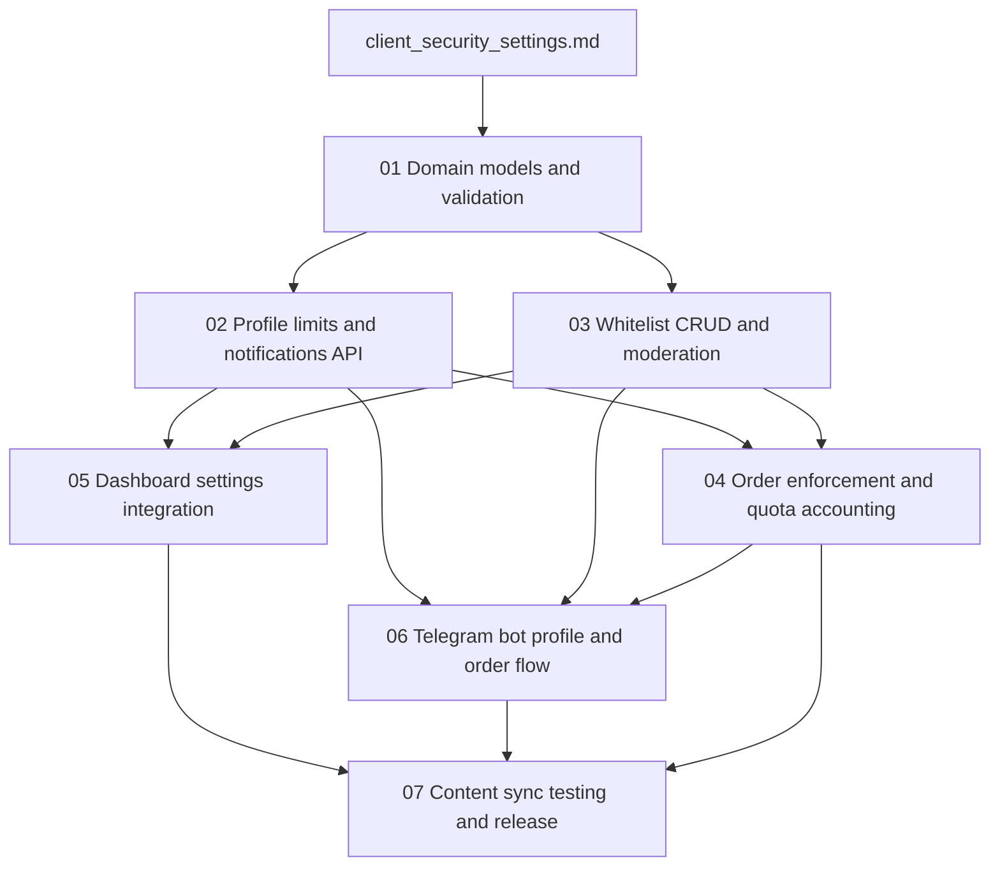

# Client Security Settings Implementation Roadmap

This roadmap defines the recommended execution order for the client security settings package so the team can implement limits, notifications, whitelist moderation, and order enforcement without rework.

## Goal

Deliver the client security settings package in a dependency-safe sequence that keeps backend contracts stable before dashboard, Telegram bot, and release validation work begins.

## Recommended Execution Order

### Phase 1. Domain contracts and validation

Start with:
- `01-domain-models-and-validation.md`

Why first:
- every API, admin, dashboard, and bot flow depends on stable storage and validation rules
- this phase fixes the v1 scope as `user_id` based and locks the whitelist, notification, and quota rules

Main outputs:
- `notification_preferences` contract in `ExchangeUserDB`
- storage contracts for `limit_quotas`, `limit_quota_history`, and `whitelist_addresses`
- order fields for whitelist linkage and wallet provenance
- shared validation rules for networks, uniqueness, caps, and rejection behavior

Exit criteria:
- all required fields from the specification have a clear destination
- no unsupported channels, networks, or company-scoped fallback behavior are introduced

### Phase 2. Profile APIs

Then implement:
- `02-profile-limits-and-notifications-api.md`

Why second:
- dashboard and bot profile surfaces need stable limit and notification contracts before UI work starts
- this phase isolates the read and update surface for the user's settings from later order-flow complexity

Main outputs:
- `GET /api/profile/limits`
- `GET /api/profile/notifications`
- `PUT /api/profile/notifications`

Exit criteria:
- the profile API exposes daily and monthly limits, usage, and remaining values
- notification settings are persisted for `telegram` and `email` only

### Phase 3. Whitelist lifecycle and moderation

After the profile API, implement:
- `03-whitelist-crud-and-moderation.md`

Why here:
- order creation cannot be enforced correctly until the whitelist lifecycle exists
- manager approval and rejection are part of the core rule, not a later enhancement

Main outputs:
- client whitelist list/create/update/delete flows
- moderation actions for approve and reject
- reject reason persistence and moderator audit metadata

Exit criteria:
- whitelist entries move only through `pending`, `active`, and `rejected`
- the 5-address cap and rejected-address resubmission ban are enforced consistently

### Phase 4. Order enforcement and quota accounting

After the whitelist flow is stable, implement:
- `04-order-enforcement-and-quota-accounting.md`

Why fourth:
- this phase depends on both the quota contracts and whitelist lifecycle
- it is the point where the package becomes enforceable at order-creation time

Main outputs:
- active-whitelist enforcement during order creation
- persisted wallet provenance and whitelist linkage in orders
- atomic quota usage updates
- admin quota-change audit writes

Exit criteria:
- orders cannot be completed to non-active whitelist addresses
- limit overflow produces a warning, not a hard block
- quota updates and audit writes are attached to the same backend ruleset

### Phase 5. Client integrations

After backend contracts are stable, implement:
- `05-dashboard-settings-integration.md`
- `06-telegram-bot-profile-and-order-flow.md`

Why now:
- the dashboard depends on stable profile and whitelist APIs
- the Telegram bot should reflect the same backend whitelist enforcement that is already active in order creation

Recommended internal order:
1. Start dashboard settings integration after `02` and `03` are stable.
2. Finish order enforcement in `04`.
3. Complete Telegram bot profile and order flow after `04`.

Main outputs:
- `/dashboard/settings` backed by real APIs instead of mocks
- Telegram `/profile` with limit visibility
- Telegram order flow aligned with active whitelist enforcement

Exit criteria:
- dashboard and bot expose the same product rules and the same data semantics
- neither client channel suggests that non-whitelisted addresses are acceptable for completed orders

### Phase 6. Content sync and release validation

Finish with:
- `07-content-sync-testing-and-release.md`

Why last:
- wording alignment and sign-off are meaningful only after backend and client flows are defined end-to-end
- this phase turns the specification acceptance criteria into a release checklist

Main outputs:
- synchronized FAQ and UI wording
- acceptance validation matrix
- non-functional verification checklist
- release readiness review

Exit criteria:
- specification sections `7`, `8`, and `9` are covered by explicit checks
- the team has one final source for sign-off across backend, admin, dashboard, bot, and content

## Parallel Work Opportunities

The following work can be parallelized after prerequisites are complete:

- `05-dashboard-settings-integration.md` can begin after `02-profile-limits-and-notifications-api.md` and `03-whitelist-crud-and-moderation.md`
- `06-telegram-bot-profile-and-order-flow.md` can begin after `04-order-enforcement-and-quota-accounting.md`
- content review for `07-content-sync-testing-and-release.md` can start earlier, but final closure should wait for dashboard and bot behavior to stabilize

## Dependency Map

## Suggested Milestones

### Milestone 1. Core data and profile contracts

Includes:
- `01-domain-models-and-validation.md`
- `02-profile-limits-and-notifications-api.md`

Outcome:
- the backend exposes a stable user-scoped contract for limits and notification settings

### Milestone 2. Whitelist control plane

Includes:
- `03-whitelist-crud-and-moderation.md`
- `04-order-enforcement-and-quota-accounting.md`

Outcome:
- whitelist approval and order enforcement are operational, and quota usage is tracked atomically

### Milestone 3. Client channel rollout

Includes:
- `05-dashboard-settings-integration.md`
- `06-telegram-bot-profile-and-order-flow.md`

Outcome:
- dashboard and Telegram bot reflect the same limits and whitelist policy

### Milestone 4. Release sign-off

Includes:
- `07-content-sync-testing-and-release.md`

Outcome:
- wording, QA, and release readiness are aligned with the specification

## Practical Team Split

### Single developer sequence

1. Complete `01-domain-models-and-validation.md`
2. Complete `02-profile-limits-and-notifications-api.md`
3. Complete `03-whitelist-crud-and-moderation.md`
4. Complete `04-order-enforcement-and-quota-accounting.md`
5. Complete `05-dashboard-settings-integration.md`
6. Complete `06-telegram-bot-profile-and-order-flow.md`
7. Complete `07-content-sync-testing-and-release.md`

### Two-stream sequence

Stream A:
- `01-domain-models-and-validation.md`
- `02-profile-limits-and-notifications-api.md`
- `03-whitelist-crud-and-moderation.md`
- `04-order-enforcement-and-quota-accounting.md`

Stream B:
- start `05-dashboard-settings-integration.md` after `02` and `03` stabilize
- start `06-telegram-bot-profile-and-order-flow.md` after `04` stabilizes

Shared follow-up:
- `07-content-sync-testing-and-release.md`

## Implementation Notes

- Keep the package strictly `user_id` scoped in v1.
- Treat limit overflow as warning behavior, not as an order hard block.
- Keep supported notification channels limited to `telegram` and `email`.
- Keep supported whitelist networks limited to `TRC-20`, `ERC-20`, and `BEP-20`.
- Do not introduce hidden retries, silent fallbacks, or partial-success behavior in the documented flows.
