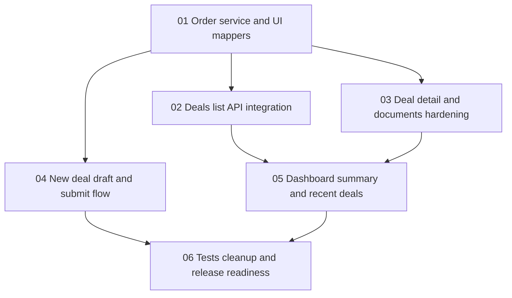

# Dashboard Orders Integration Roadmap

This roadmap defines the recommended execution order for finishing frontend integration of dashboard and deal flows against the existing backend orders, drafts, and deal-documents APIs without spreading mock-era assumptions into the final implementation.

## Goal

Deliver a dependency-safe rollout that replaces runtime mock data in authenticated dashboard and deal flows with real backend data while preserving explicit error handling, stable UI models, and existing authenticated request behavior.

## Recommended Execution Order

### Phase 1. Order service and UI mapping foundation

Start with:
- `01-order-service-and-ui-mappers.md`

Why first:
- every dashboard and deals screen depends on one stable authenticated service layer
- the backend speaks in `orders`, while the frontend presentation layer still speaks in `deals`
- one explicit mapper prevents contract drift and avoids hidden fallback defaults in page components

Main outputs:
- `orderService` added to `front/src/config/service.ts`
- frontend API types for `OrderResponse`, `OrderListResponse`, and current draft payloads
- one explicit `OrderResponse -> Deal` mapper
- documented handling for backend `timeline`, `status_meta`, and draft-step values

Exit criteria:
- no dashboard or deals page fetches order data without using `orderService`
- required backend fields are mapped explicitly rather than guessed or defaulted
- the UI model stays presentation-oriented instead of leaking backend field names everywhere

### Phase 2. Deals list API integration

Then implement:
- `02-deals-list-api-integration.md`

Why second:
- the list page is the safest first runtime consumer of the new service layer
- it validates auth, filtering, mapping, and empty/error states before more sensitive flows are migrated

Main outputs:
- `/dashboard/deals` reads `GET /orders`
- status filters are wired to backend-supported values
- first-pass pagination behavior is explicit and documented
- `DealsTable` remains UI-focused and mapper-driven

Exit criteria:
- the deals page renders only real backend data
- no runtime dependency on `mockDeals` remains in the list flow
- loading, empty, and error states are explicit

### Phase 3. Deal detail and documents hardening

After the list is stable, implement:
- `03-deal-detail-and-documents-hardening.md`

Why third:
- the current detail page has the highest risk of showing a fake deal while calling real document endpoints
- this phase reuses both the new order service and the existing deal-document service

Main outputs:
- `/dashboard/deals/:id` reads `GET /orders/{order_id}` for the primary card
- deal documents stay on `/api/deals/{deal_id}/documents`
- the mock fallback `mockDeals.find(...) || mockDeals[0]` is removed
- explicit `404`, `409`, and generic failure states are defined

Exit criteria:
- the page never substitutes another deal when lookup fails
- timeline and status render from backend data, not mocks
- deal documents remain scoped to the requested real order id

### Phase 4. New deal draft and submit flow

Next implement:
- `04-new-deal-draft-and-submit-flow.md`

Why fourth:
- the current new-deal page can claim success without creating anything in the backend
- the draft flow depends on the service and mapping decisions established in phase 1

Main outputs:
- `/dashboard/new-deal` restores an existing draft from `GET /order-drafts/current`
- wizard progress is persisted with `PUT /order-drafts/current`
- final submission uses `POST /order-drafts/current/submit`
- success UI is driven by the real backend response and real `order_id`

Exit criteria:
- a success state is impossible without successful submit response
- draft recovery and submit errors are explicit and observable
- the wizard aligns with backend `DraftStep` values `amount`, `address`, and `confirm`

### Phase 5. Dashboard summary and recent deals

Then implement:
- `05-dashboard-summary-and-recent-deals.md`

Why fifth:
- dashboard semantics should follow after list and detail behavior is already proven on real data
- this is the right moment to decide whether turnover stays a temporary client-side aggregate or becomes a dedicated backend summary endpoint

Main outputs:
- `/dashboard` stops reading runtime mock deals
- latest deal, recent deals, and activity blocks use real `orders`
- the summary strategy is documented as either frontend aggregation or a backend follow-up

Exit criteria:
- the dashboard no longer depends on `mockDeals`
- recent deals and last deal reflect authenticated backend state
- any remaining aggregation gap is documented explicitly rather than masked with placeholder values

### Phase 6. Tests, cleanup, and release readiness

Finish with:
- `06-tests-cleanup-and-release-readiness.md`

Why last:
- cleanup is safest after all runtime integrations are in place
- tests should lock the intended real-data behavior, not transitional mock behavior

Main outputs:
- focused frontend integration tests for list, detail, dashboard, and submit flows
- runtime mock dependencies removed or relocated to test-only/shared static config
- final validation checklist for linting, tests, and release readiness

Exit criteria:
- highest-risk flows are covered by regression checks
- runtime dashboard and deals pages no longer depend on mock data
- docs capture final data flow and known backend limitations

## Parallel Work Opportunities

The following work can be parallelized after prerequisites are complete:

- `02-deals-list-api-integration.md` and `03-deal-detail-and-documents-hardening.md` can move in parallel after `01-order-service-and-ui-mappers.md` stabilizes
- `05-dashboard-summary-and-recent-deals.md` can begin once list semantics from `02` and detail semantics from `03` are understood
- test preparation for `06-tests-cleanup-and-release-readiness.md` can begin early, but final cleanup should wait for all runtime pages to stop using mocks

## Dependency Map

## Suggested Milestones

### Milestone 1. Service and contract stabilization

Includes:
- `01-order-service-and-ui-mappers.md`

Outcome:
- the frontend has one stable authenticated contract layer for orders and drafts

### Milestone 2. Read flows on real data

Includes:
- `02-deals-list-api-integration.md`
- `03-deal-detail-and-documents-hardening.md`

Outcome:
- authenticated deal browsing uses backend data end to end

### Milestone 3. Write flow rollout

Includes:
- `04-new-deal-draft-and-submit-flow.md`
- `05-dashboard-summary-and-recent-deals.md`

Outcome:
- new-deal creation and dashboard surfaces reflect real backend state instead of runtime mocks

### Milestone 4. Final validation

Includes:
- `06-tests-cleanup-and-release-readiness.md`

Outcome:
- regression checks and cleanup lock the integration for release

## Practical Team Split

### Single developer sequence

1. Complete `01-order-service-and-ui-mappers.md`
2. Complete `02-deals-list-api-integration.md`
3. Complete `03-deal-detail-and-documents-hardening.md`
4. Complete `04-new-deal-draft-and-submit-flow.md`
5. Complete `05-dashboard-summary-and-recent-deals.md`
6. Complete `06-tests-cleanup-and-release-readiness.md`

### Two-stream sequence

Stream A:
- `01-order-service-and-ui-mappers.md`
- `02-deals-list-api-integration.md`
- `05-dashboard-summary-and-recent-deals.md`

Stream B:
- start `03-deal-detail-and-documents-hardening.md` after `01` stabilizes
- start `04-new-deal-draft-and-submit-flow.md` after `01` stabilizes

Shared follow-up:
- `06-tests-cleanup-and-release-readiness.md`

## Implementation Notes

- Preserve the existing authenticated request behavior in `front/src/config/service.ts` rather than introducing a second fetch wrapper.
- Follow current backend contract names exactly and do not rename environment-driven variables.
- Treat backend `orders` as the source of truth and frontend `Deal` as a presentation model only.
- Keep failure handling explicit. Missing required backend fields should fail clearly instead of being silently substituted.
- If network options remain static UI config after runtime mock cleanup, move them out of `dashboardMocks.ts` into a neutral config file rather than keeping them in a mock bundle.
