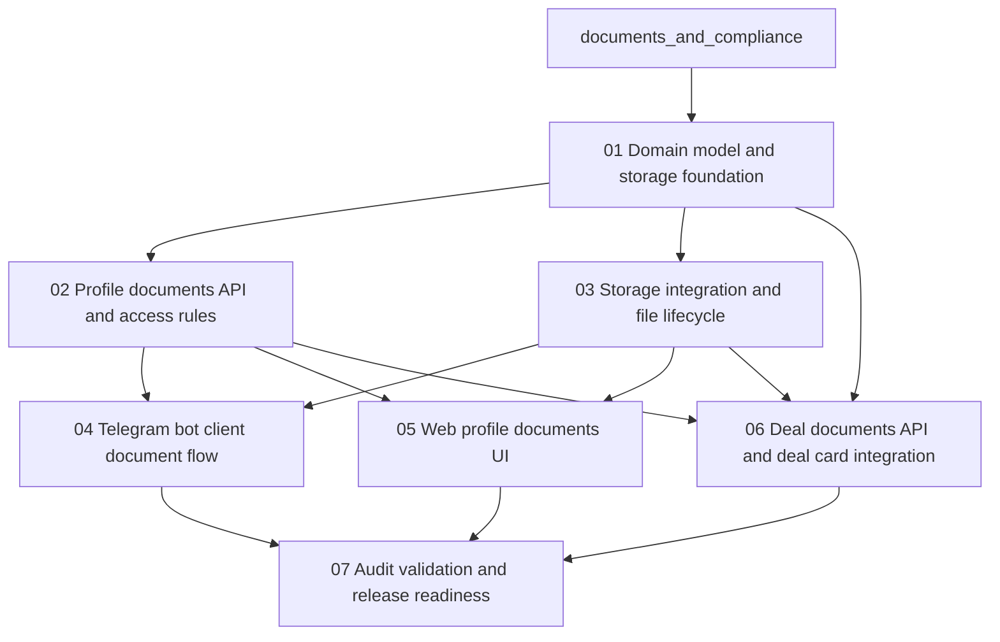

# Documents And Compliance Implementation Roadmap

This roadmap defines the recommended execution order for the documents and compliance package so the team can deliver profile documents, deal documents, storage integration, and access control without rework.

## Goal

Deliver the MVP in a dependency-safe sequence that stabilizes the shared document model, storage lifecycle, and access rules before Telegram bot, web profile, and deal-card integrations are completed.

## Recommended Execution Order

### Phase 1. Domain model and storage foundation

Start with:
- `01-domain-model-and-storage-foundation.md`

Why first:
- both profile documents and deal documents depend on one shared extension of `MaterialDB`
- this phase locks the enum values, required fields, replacement rules, and index expectations that every later task uses

Main outputs:
- `MaterialContentType` extended with `CLIENT_DOC` and `DEAL_DOC`
- document-type enums for client and deal documents
- documented `MaterialDB` field additions for `deal_id`, document types, file metadata, and `s3_key`
- uniqueness and replacement rules for client documents
- index requirements for `user_id`, `content_type`, `deal_id`, and `created_at`

Exit criteria:
- every required field from the specification has a clear storage destination
- the model distinguishes profile documents from deal documents without introducing a separate document service

### Phase 2. Profile documents API and access rules

Then implement:
- `02-profile-documents-api-and-access-rules.md`

Why second:
- bot and web profile flows need one stable backend contract for listing, uploading, downloading, and deleting client documents
- this phase fixes the authorization and validation rules before channel-specific work begins

Main outputs:
- `GET /api/profile/documents`
- `POST /api/profile/documents`
- `DELETE /api/profile/documents/{document_id}`
- `GET /api/profile/documents/{document_id}/download`
- explicit `400`, `403`, and `404` behavior

Exit criteria:
- profile document endpoints expose one consistent response contract
- access checks are documented as mandatory for every document operation

### Phase 3. Storage integration and file lifecycle

After the API surface is defined, implement:
- `03-storage-integration-and-file-lifecycle.md`

Why here:
- bot upload, web upload, and deal-document download all depend on one storage contract
- this phase turns the MVP requirement of S3/MinIO-backed downloads into explicit backend behavior

Main outputs:
- document bucket and object-key conventions
- upload and download abstraction for S3/MinIO
- Telegram-to-storage transfer flow
- presigned URL generation with 15-minute TTL
- explicit failure handling for Telegram download and storage upload errors

Exit criteria:
- the system persists only `s3_key` and metadata in the database
- downloads are defined as storage-backed flows, not Telegram-backed or public-link flows

### Phase 4. Client document channel integrations

After backend contracts are stable, implement:
- `04-telegram-bot-client-document-flow.md`
- `05-web-profile-documents-ui.md`

Why now:
- both client channels depend on the same validation, replacement, and download contract
- this phase turns the profile-document MVP into working user flows across Telegram bot and web

Recommended internal order:
1. Complete the Telegram bot upload flow after `02` and `03` are stable.
2. Complete the web profile documents flow after `02` and `03` are stable.
3. Align both channels on the same supported formats, size limits, replacement semantics, and user-facing error messages.

Main outputs:
- Telegram bot client-document upload and confirmation flow
- web profile documents section with upload, list, download, and delete actions
- channel-consistent validation and replacement behavior

Exit criteria:
- a user can upload a client document through both bot and web
- both channels reflect the same document metadata and replacement rules

### Phase 5. Deal documents API and deal card integration

After the shared model and storage pipeline are proven, implement:
- `06-deal-documents-api-and-deal-card-integration.md`

Why fifth:
- deal documents reuse the same storage and access-control foundations as profile documents
- the current deal-card documents section is mock-based and should only be replaced after the document backend contract is stable

Main outputs:
- `GET /api/deals/{deal_id}/documents`
- `GET /api/deals/{deal_id}/documents/{document_id}/download`
- `POST /api/deals/{deal_id}/documents`
- deal access checks for every document operation
- deal card wired to real API data instead of mocks

Exit criteria:
- the deal card loads documents from the backend, not mock data
- users can download only documents for deals they are allowed to access

### Phase 6. Audit, validation, and release readiness

Finish with:
- `07-audit-validation-and-release-readiness.md`

Why last:
- release validation is meaningful only after storage, backend, bot, and web flows exist end to end
- this phase converts non-functional requirements and MVP readiness into a practical sign-off checklist

Main outputs:
- audit coverage for upload, download, delete, replace, and deal-link actions
- validation matrix for size, format, access-control, and storage-failure scenarios
- MVP Definition of Done checklist
- release-readiness review for backend, bot, and web

Exit criteria:
- specification sections `5`, `11`, `12`, and `13` are mapped to explicit checks
- the team has one final source for launch validation and sign-off

## Parallel Work Opportunities

The following work can be parallelized after prerequisites are complete:

- `04-telegram-bot-client-document-flow.md` and `05-web-profile-documents-ui.md` can run in parallel after `02-profile-documents-api-and-access-rules.md` and `03-storage-integration-and-file-lifecycle.md`
- review and planning work for `06-deal-documents-api-and-deal-card-integration.md` can begin after `01-domain-model-and-storage-foundation.md`, but implementation should wait for the storage and access rules to stabilize
- validation preparation for `07-audit-validation-and-release-readiness.md` can start early, but final closure should wait for all integration work to complete

## Dependency Map

## Suggested Milestones

### Milestone 1. Shared document backbone

Includes:
- `01-domain-model-and-storage-foundation.md`
- `02-profile-documents-api-and-access-rules.md`
- `03-storage-integration-and-file-lifecycle.md`

Outcome:
- the backend has one stable contract for document storage, metadata, access control, and download behavior

### Milestone 2. Client document rollout

Includes:
- `04-telegram-bot-client-document-flow.md`
- `05-web-profile-documents-ui.md`

Outcome:
- users can manage profile documents through Telegram bot and web with the same product rules

### Milestone 3. Deal document rollout

Includes:
- `06-deal-documents-api-and-deal-card-integration.md`

Outcome:
- deal documents are loaded from real APIs and protected by deal-level access checks

### Milestone 4. Final validation and sign-off

Includes:
- `07-audit-validation-and-release-readiness.md`

Outcome:
- the package is validated against functional, non-functional, and release-readiness requirements

## Practical Team Split

### Single developer sequence

1. Complete `01-domain-model-and-storage-foundation.md`
2. Complete `02-profile-documents-api-and-access-rules.md`
3. Complete `03-storage-integration-and-file-lifecycle.md`
4. Complete `04-telegram-bot-client-document-flow.md`
5. Complete `05-web-profile-documents-ui.md`
6. Complete `06-deal-documents-api-and-deal-card-integration.md`
7. Complete `07-audit-validation-and-release-readiness.md`

### Two-stream sequence

Stream A:
- `01-domain-model-and-storage-foundation.md`
- `02-profile-documents-api-and-access-rules.md`
- `03-storage-integration-and-file-lifecycle.md`

Stream B:
- start `04-telegram-bot-client-document-flow.md` after `02` and `03` stabilize
- start `05-web-profile-documents-ui.md` after `02` and `03` stabilize
- start `06-deal-documents-api-and-deal-card-integration.md` after `03` stabilizes and access rules from `02` are fixed

Shared follow-up:
- `07-audit-validation-and-release-readiness.md`

## Implementation Notes

- Keep the MVP aligned with the existing `MaterialDB` contour instead of introducing a separate document subsystem.
- Treat S3/MinIO as the primary source of truth for downloadable files.
- Keep `s3_url` out of the database and generate download links dynamically.
- Keep client document replacement explicit for the same `client_doc_type`; do not introduce silent versioning in MVP.
- Do not rely on hidden retries, public permanent links, or fallback download paths from Telegram.
