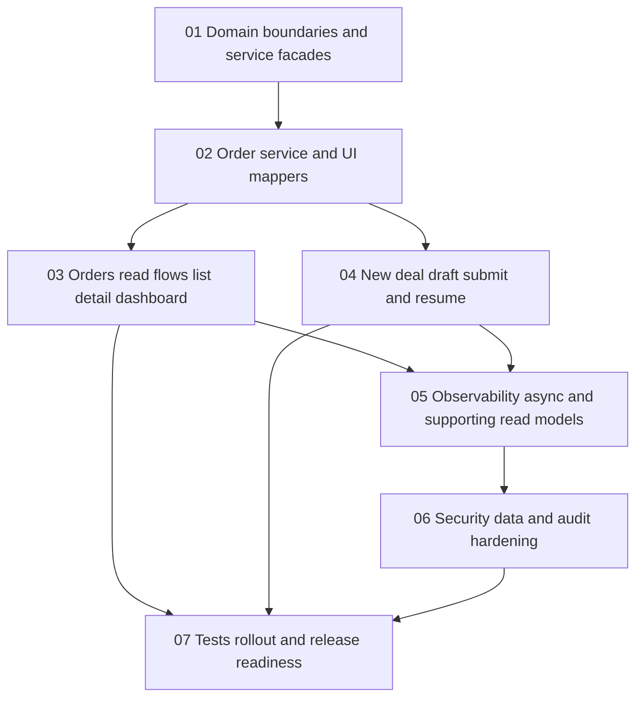

# Exchange Master Plan Roadmap

This roadmap defines the recommended execution order for the exchange product track so the team can finish the live dashboard and order flows without reinforcing mock-era assumptions or legacy coupling.

## Goal

Deliver a dependency-safe sequence that:

- separates the exchange path from the legacy moderation/admin contour
- standardizes service entry points for new exchange work
- replaces runtime dashboard mock data with real backend order and draft data
- adds explicit observability, async discipline, and hardening work around the core flows
- finishes with release-ready regression coverage and rollout notes

## Recommended Execution Order

### Phase 1. Domain boundaries and service facades

Start with:
- `01-domain-boundaries-and-service-facades.md`

Why first:
- the exchange contour should stop inheriting new accidental dependencies from legacy modules
- frontend, bot, and web work need canonical entry points before more features are added
- this phase reduces coupling without forcing a disruptive rewrite

Main outputs:
- documented exchange-versus-legacy ownership boundaries
- canonical facade entry points such as `OrderService`, `ProfileService`, and `DocumentService`
- explicit rule that new exchange code goes through stable facades instead of ad hoc direct imports
- lightweight review or checklist guidance for dependency discipline

Exit criteria:
- the team has one documented boundary for where new exchange work belongs
- new exchange work has named service entry points instead of expanding direct `shared` access
- the phase does not introduce breaking API or storage changes

### Phase 2. Order service and UI mappers

Then implement:
- `02-order-service-and-ui-mappers.md`

Why second:
- every dashboard and deals page depends on one stable authenticated service layer
- the backend speaks in `orders`, while the frontend presentation layer still speaks in `deals`
- one explicit mapper prevents hidden fallback defaults from spreading across page components

Main outputs:
- `orderService` added to `front/src/config/service.ts`
- frontend API types for `OrderResponse`, `OrderListResponse`, and current draft payloads
- one explicit mapper from backend `OrderResponse` to the presentation-oriented `Deal` model
- documented handling for backend `timeline`, `status_meta`, and draft-step values

Exit criteria:
- no dashboard or deals page fetches order data without using `orderService`
- required backend fields are mapped explicitly rather than guessed or defaulted
- the UI model stays presentation-oriented instead of leaking backend field names everywhere

### Phase 3. Orders read flows: list, detail, dashboard

After the service layer is stable, implement:
- `03-orders-read-flows-list-detail-dashboard.md`

Why third:
- read flows are the safest first runtime consumers of the new service layer
- the current detail and dashboard surfaces still carry the highest risk of showing mock or substitute content
- this phase proves real-data browsing before write-flow rollout begins

Main outputs:
- `/dashboard/deals` reads `GET /orders`
- `/dashboard/deals/{id}` reads `GET /orders/{order_id}` for the primary card
- `/dashboard` uses authenticated backend orders for last-deal and recent-deals surfaces
- deal documents remain on the existing deal-document API with real order ids

Exit criteria:
- runtime list, detail, and dashboard pages no longer depend on `mockDeals`
- the detail page never substitutes another deal when lookup fails
- loading, empty, `404`, `409`, and generic failure states are explicit

### Phase 4. New deal draft, submit, and resume

Next implement:
- `04-new-deal-draft-submit-and-resume.md`

Why fourth:
- the current new-deal flow can still imply success without a real backend submit
- this phase depends on the service and mapping decisions already stabilized in phase 2
- draft restore and autosave should be aligned with real backend semantics before broader rollout

Main outputs:
- `/dashboard/new-deal` restores an existing draft from `GET /order-drafts/current`
- wizard progress is persisted with `PUT /order-drafts/current`
- final submission uses `POST /order-drafts/current/submit`
- success UI is driven by the real backend response and real `order_id`

Exit criteria:
- a success state is impossible without a successful submit response
- draft recovery and submit errors are explicit and observable
- the wizard aligns with backend `DraftStep` values instead of the old local-only flow

### Phase 5. Observability, async, and supporting read models

Then implement:
- `05-observability-async-and-supporting-read-models.md`

Why fifth:
- once live read and write flows exist, the team needs correlation and queue discipline to operate them safely
- `TZ.md` identifies observability and async consistency as low-risk, high-value improvements
- this phase creates the backbone for future timeline, compliance, and notification-oriented surfaces

Main outputs:
- one request and event `correlation_id` strategy across HTTP, bot, and Redis paths
- soft-versioned queue envelope rules for new async consumers
- explicit logging expectations for request failures and message processing failures
- documented follow-up read-model opportunities for timeline, compliance readiness, and notification surfaces

Exit criteria:
- new async producers and consumers have one documented envelope contract
- errors are observable with context instead of being silently downgraded
- read-model follow-ups are documented honestly rather than implied by placeholders

### Phase 6. Security, data, and audit hardening

After observability is fixed, implement:
- `06-security-data-and-audit-hardening.md`

Why sixth:
- hardening work is safest after the primary runtime flow is already defined
- `TZ.md` highlights MIME validation, rate limiting, auditability, and index review as necessary non-breaking improvements
- this phase strengthens operational safety without changing the product contract

Main outputs:
- stricter server-side validation for uploads and public-facing forms
- index review for orders, drafts, whitelist, support, and session-heavy collections
- audit writes for critical status transitions and moderation decisions
- documented separation expectations for moderator-facing surfaces

Exit criteria:
- hardening rules are explicit and bounded rather than hidden in ad hoc code paths
- audit and index work are documented as infrastructure-safe changes
- no required configuration values are renamed without need

### Phase 7. Tests, rollout, and release readiness

Finish with:
- `07-tests-rollout-and-release-readiness.md`

Why last:
- cleanup and release validation are only meaningful after runtime integrations and hardening work are defined
- tests should lock the intended real-data behavior, not the transitional mock behavior

Main outputs:
- focused frontend regression tests for list, detail, dashboard, and submit flows
- backend contract and smoke scenarios for the exchange path
- runtime mock cleanup and final rollout notes
- one release-readiness checklist for known backend gaps and validation steps

Exit criteria:
- the highest-risk exchange flows are covered by automated checks
- runtime dashboard and deals pages no longer depend on mock-era behavior
- the team has one final source for rollout sign-off and known limitations

## Parallel Work Opportunities

The following work can be parallelized after prerequisites are complete:

- `03-orders-read-flows-list-detail-dashboard.md` can be split internally after `02-order-service-and-ui-mappers.md` stabilizes
- `05-observability-async-and-supporting-read-models.md` can begin once phase 4 contracts are clear, even if some hardening from phase 6 is still pending
- preparation for `07-tests-rollout-and-release-readiness.md` can start early, but final cleanup should wait for runtime mock dependencies to be removed

## Dependency Map

## Suggested Milestones

### Milestone 1. Architecture and contract stabilization

Includes:
- `01-domain-boundaries-and-service-facades.md`
- `02-order-service-and-ui-mappers.md`

Outcome:
- the exchange path has clear ownership boundaries and one stable service contract for orders and drafts

### Milestone 2. Read-flow migration

Includes:
- `03-orders-read-flows-list-detail-dashboard.md`

Outcome:
- authenticated deal browsing and dashboard summaries use backend data end to end

### Milestone 3. Write-flow rollout and observability

Includes:
- `04-new-deal-draft-submit-and-resume.md`
- `05-observability-async-and-supporting-read-models.md`

Outcome:
- draft restore, submit, and cross-surface diagnostics behave like a real product flow instead of a local demo path

### Milestone 4. Hardening and sign-off

Includes:
- `06-security-data-and-audit-hardening.md`
- `07-tests-rollout-and-release-readiness.md`

Outcome:
- the exchange path is validated for rollout with explicit hardening, tests, and known limitations

## Practical Team Split

### Single developer sequence

1. Complete `01-domain-boundaries-and-service-facades.md`
2. Complete `02-order-service-and-ui-mappers.md`
3. Complete `03-orders-read-flows-list-detail-dashboard.md`
4. Complete `04-new-deal-draft-submit-and-resume.md`
5. Complete `05-observability-async-and-supporting-read-models.md`
6. Complete `06-security-data-and-audit-hardening.md`
7. Complete `07-tests-rollout-and-release-readiness.md`

### Two-stream sequence

Stream A:
- `01-domain-boundaries-and-service-facades.md`
- `02-order-service-and-ui-mappers.md`
- `03-orders-read-flows-list-detail-dashboard.md`
- `04-new-deal-draft-submit-and-resume.md`

Stream B:
- start `05-observability-async-and-supporting-read-models.md` after phases `03` and `04` define the live flow boundaries
- start `06-security-data-and-audit-hardening.md` after the observability contract from `05` is fixed

Shared follow-up:
- `07-tests-rollout-and-release-readiness.md`

## Implementation Notes

- Keep the exchange track isolated from legacy modules by policy before attempting a larger refactor.
- Preserve existing environment variable names and current authenticated request behavior.
- Treat backend `orders` as the source of truth and frontend `Deal` as a presentation model only.
- Keep failure handling explicit. Missing required backend fields should fail clearly instead of being silently substituted.
- Do not introduce hidden retries, silent fallbacks, fake success states, or partial-success wording in the documented flows.
- If dashboard aggregates need a dedicated backend endpoint, document that gap explicitly instead of simulating complete data on the frontend.
