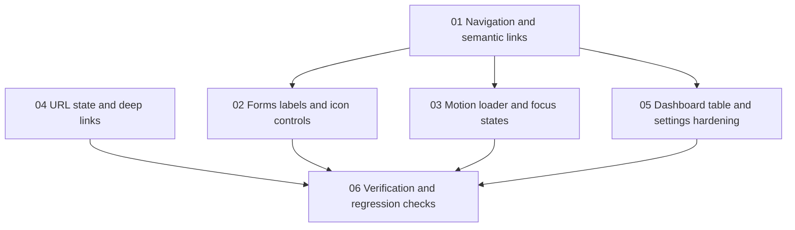

# Frontend Accessibility And URL-State Roadmap

This roadmap defines the recommended execution order for the frontend accessibility and URL-state fixes requested across shared layout components, form flows, dashboard pages, and global interaction styles.

## Goal

Deliver a dependency-safe accessibility pass that:

- replaces non-semantic navigation controls with real links where location changes
- adds stable accessible names and label associations to icon-only controls and form fields
- introduces explicit reduced-motion and focus-visible handling for shared UI patterns
- moves shareable page state into the URL where the current UI represents a navigable or deep-linkable view

## Recommended Execution Order

### Phase 1. Navigation and semantic links

Start with:
- `01-navigation-and-semantic-links.md`

Why first:
- `Header.tsx` and `Footer.tsx` are shared entry points for public navigation
- replacing `button + navigate(...)` patterns early establishes the semantic navigation baseline for later page work
- Telegram icon-link naming and shared focus styling belong to the same layout pass

Main outputs:
- header and footer navigation use `Link` or `a` for real navigation targets
- desktop and mobile navigation follow one semantic pattern
- icon-only social links expose stable accessible names
- shared layout transitions stop using broad `transition-all` declarations

Exit criteria:
- no shared site navigation relies on `button` elements for route changes
- Telegram links in header and footer expose an explicit accessible name
- shared icon-style controls retain a visible `:focus-visible` treatment

### Phase 2. Forms, labels, and icon controls

Then implement:
- `02-forms-labels-and-icon-controls.md`

Why second:
- form semantics issues repeat across the request modal, contacts page, and auth pages
- one pass can standardize `name`, `id`, `autocomplete`, and icon-button labeling before smaller page-specific hardening

Main outputs:
- required form controls expose stable `name` attributes
- email and phone fields use the right `autocomplete` and input hints
- close buttons and password-visibility toggles expose explicit accessible names
- submit-button disabling behavior in `RequestModal` matches the requested UX rule

Exit criteria:
- the listed auth, modal, and public-form fields no longer miss required `name` or `id` attributes
- icon-only form controls are screen-reader identifiable
- requested text changes to `Submitting... -> Submitting…` and `Loading... -> Loading…` are documented and implemented in their target phases

### Phase 3. Motion, loader, and focus states

After form semantics are stable, implement:
- `03-motion-loader-and-focus-states.md`

Why third:
- reduced-motion and focus-visible behavior affects shared patterns rather than isolated screens
- replacing broad transition rules is safer after the control semantics are already settled

Main outputs:
- `prefers-reduced-motion` handling for the request modal and page loader
- explicit loader announcement behavior through `role="status"` and/or `aria-live`
- visible custom focus treatment where `outline-none` remains in shared UI styles
- all listed `transition-all` and `transition: all` usages are narrowed to explicit properties

Exit criteria:
- reduced-motion users are not forced through decorative animation in the listed components
- shared icon and tab controls keep visible focus indication
- no reviewed file still uses the flagged broad transition declarations

### Phase 4. URL state and deep links

Next implement:
- `04-url-state-and-deep-links.md`

Why fourth:
- `HashRouter` behavior must be handled consistently before page-level URL state becomes user-visible
- deals filters, FAQ search, and legal deep links share the same explicit parse and serialize concerns

Main outputs:
- dashboard deals filters are reflected in the URL
- FAQ search state is shareable via query params
- legal sections can be opened directly from a deep link
- invalid query values are validated explicitly instead of being remapped to another state

Exit criteria:
- the listed page states survive refresh and can be shared by URL
- unsupported query values do not silently map to a different valid state
- deep links do not open the wrong legal section

### Phase 5. Dashboard table and settings hardening

Then implement:
- `05-dashboard-table-and-settings-hardening.md`

Why fifth:
- `DealsTable.tsx` needs a local interaction decision after shared navigation semantics are already defined
- dashboard settings fixes combine accessibility wiring and a smaller formatting cleanup in one page-specific pass

Main outputs:
- deals navigation becomes keyboard-accessible and semantically valid inside the table
- dashboard settings labels are correctly associated with their controls
- settings date rendering uses `Intl.DateTimeFormat` instead of direct `toLocaleString('ru-RU', ...)`

Exit criteria:
- the deals table no longer relies on clickable `tr` elements for primary navigation
- settings labels, `id`, and `name` usage are internally consistent
- dashboard date formatting is centralized through an explicit formatter object

### Phase 6. Verification and regression checks

Finish with:
- `06-verification-and-regression-checks.md`

Why last:
- verification is most useful once all targeted fixes are present
- regression checks should lock intended accessible behavior, not transitional behavior

Main outputs:
- focused lint and type-check verification for touched frontend files
- keyboard, reduced-motion, loader-announcement, and URL-state manual checks
- targeted automated coverage only where it materially reduces regression risk

Exit criteria:
- touched files pass the agreed validation steps
- the highest-risk accessibility changes have explicit manual verification notes
- no follow-up scope is hidden inside this pass

## Parallel Work Opportunities

The following work can move in parallel once prerequisites are clear:

- `02-forms-labels-and-icon-controls.md` and `03-motion-loader-and-focus-states.md` can overlap after `01-navigation-and-semantic-links.md` establishes shared control semantics
- `04-url-state-and-deep-links.md` can proceed independently from form-focused changes once `HashRouter` handling is documented
- `05-dashboard-table-and-settings-hardening.md` can begin after the navigation pattern from phase 1 is settled

## Dependency Map

## Suggested Milestones

### Milestone 1. Shared interaction semantics

Includes:
- `01-navigation-and-semantic-links.md`
- `02-forms-labels-and-icon-controls.md`

Outcome:
- shared navigation and form controls expose the expected semantic and accessibility baseline

### Milestone 2. Shared interaction hardening

Includes:
- `03-motion-loader-and-focus-states.md`
- `04-url-state-and-deep-links.md`

Outcome:
- motion preferences, focus visibility, and shareable page state behave consistently across public and dashboard routes

### Milestone 3. Dashboard-specific cleanup

Includes:
- `05-dashboard-table-and-settings-hardening.md`

Outcome:
- dashboard-only table and settings issues are resolved without reintroducing non-semantic patterns

### Milestone 4. Final validation

Includes:
- `06-verification-and-regression-checks.md`

Outcome:
- the accessibility pass is backed by explicit verification and scoped regression coverage

## Implementation Notes

- Use explicit control semantics rather than imperative navigation when the target is another route or document section.
- Do not invent fallback values for required URL params, form data, or date formatting inputs.
- Keep validation explicit. Unknown URL state must not be silently translated into another valid filter or expanded section.
- Reuse shared patterns only when they reduce duplication without hiding field requirements or accessibility behavior.
